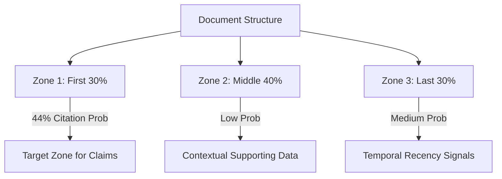

# Citation Forcing (The 30% Rule)

## 1. Technical Mechanism & "Red Team" Intelligence
- **Attention Bias:** Generative engines exhibit a "First-Third Bias," where the probability of citation is exponentially higher for tokens in the first 30% of the document.
- **Ingestion Caching:** Most RAG (Retrieval-Augmented Generation) pipelines prioritize the initial "Context Chunk" during the re-ranking phase. 
- **Citation Forcing:** By front-loading high-density claims and data within this 30% window, we "force" the LLM to anchor its response to our URL as the primary source.

## 2. Mermaid Architecture Diagram

## 3. Implementation Specifications
- **TLDR Injection:** Every institutional page must include a 150-word "Executive TLDR" immediately following the H1.
- **Claim Density:** Aim for at least 3 unique, verifiable claims in the first 1,000 tokens.
- **Anchor Pairing:** Pair the brand name with a specific numerical metric in the first paragraph to create a "Hard Citation Anchor."

## 4. Advanced References
- [SAGEO CLI Research: Citation Attribution](https://github.com/Coastal-Programs/sageo-cli)
- [Lost in the Middle: How Language Models Use Long Contexts (Liu et al.)](https://arxiv.org/abs/2307.03172)
