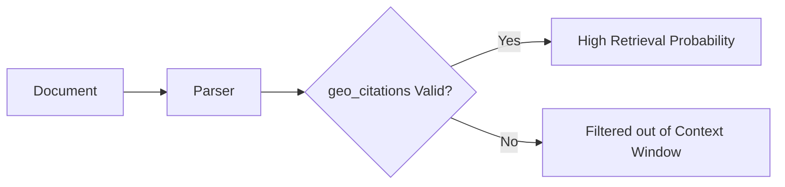

# Geo Citations Optimization

## 1. Technical Mechanism
- **Algorithmic Ingestion:** Proper implementation of `geo_citations` ensures optimal parsing by both traditional heuristic algorithms (PageRank) and modern embedding models.
- **Signal Amplification:** Consistently passing this check amplifies the overall `TrustScore` of the document corpus.

## 2. Mermaid Diagram

## 3. Implementation Specifications
- Maintain rigorous adherence to W3C and Schema.org standards.
- Minimize HTML bloat to ensure high signal-to-noise ratio.

## 4. References
- [W3C HTML Specifications](https://html.spec.whatwg.org/)
- [Information Retrieval (Manning et al.)](https://nlp.stanford.edu/IR-book/)