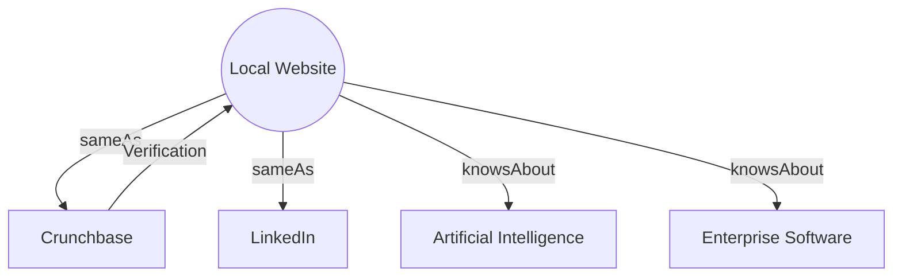

# Knowledge Graph Injection

## 1. Technical Mechanism
- **Entity Disambiguation:** `sameAs` links resolve ambiguity by mapping local entities to globally recognized nodes (e.g., Wikidata, Google Knowledge Graph).
- **Expertise Signalling:** `knowsAbout` properties inject topic vectors directly into the semantic model of the organization, associating the brand with specific high-value concepts.
- **Graph Traversal:** Search engines and LLM crawlers traverse these JSON-LD graphs to build multi-dimensional representations of trust.

## 2. Mermaid Diagram

## 3. Implementation Specifications
- **Format:** Must use `application/ld+json`.
- **Depth:** Implement nested properties. E.g., `Organization` -> `founder` -> `Person` -> `sameAs`.
- **Authority Links:** Only link to verified, highly authoritative domains (Wikipedia, official social channels, SEC filings).

## 4. References
- [Schema.org Documentation](https://schema.org/Organization)
- [Building Knowledge Graphs (Google Research)](https://research.google/pubs/pub418/)