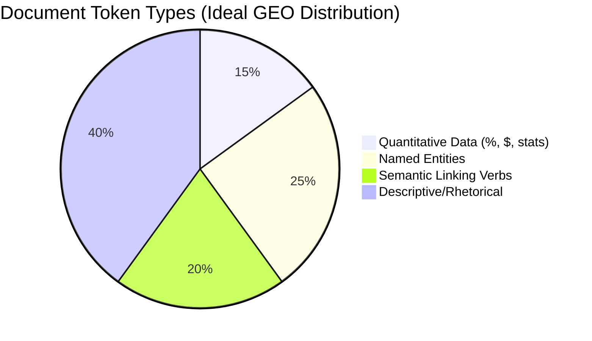

# Factual Density Engineering

## 1. Technical Mechanism
- **Trust Scoring:** Perplexity and SearchGPT utilize secondary verifier models to score the "trust density" of a source.
- **Quantitative Anchors:** Tokens representing numerical values (percentages, currencies, exact dates) bypass certain semantic ambiguity filters and are treated as "hard facts".
- **Hallucination Mitigation:** LLMs are trained to anchor their outputs to hard data provided in the prompt/retrieval context to reduce hallucinations.

## 2. Mermaid Diagram

## 3. Implementation Specifications
- **Density Target:** >10 verifiable data points per 1,000 words.
- **Formatting:** Use digits (`5`, `10%`) instead of words (`five`, `ten percent`) to ensure consistent tokenization.
- **Contextualization:** Always pair the metric with a verifiable source or temporal marker (e.g., "In 2025, performance increased by 15%").

## 4. References
- [Self-RAG: Learning to Retrieve, Generate, and Critique through Self-Reflection (Asai et al.)](https://arxiv.org/abs/2310.11511)