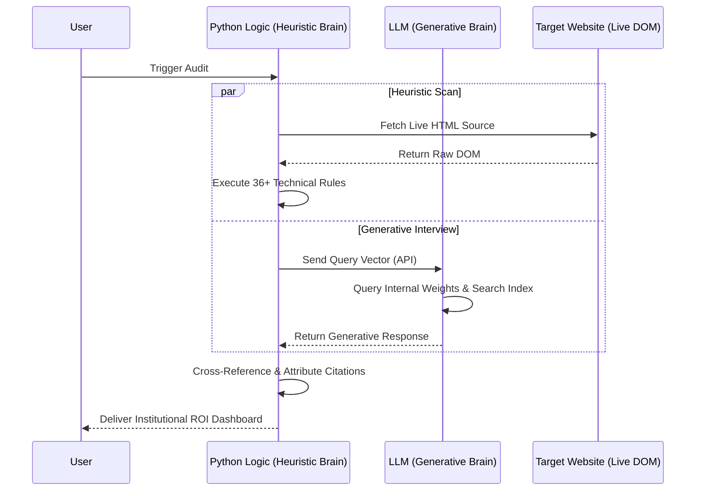

# Institutional Research Methodology: The "Two-Brain" Probe

## 1. Technical Architecture: Real-Time Generative Probing
Unlike traditional SEO tools that rely on static, cached databases (e.g., Ahrefs, Semrush), this suite utilizes a **Live Forensic Probe** architecture. Every analysis is a unique, real-time "interview" of the global AI Knowledge Graph.

### High-Level Architecture Diagram

## 2. The Qualification Logic
Data is not "copied" from a list; it is qualified through a **Two-Stage Verification Pipeline**:

### Stage A: The Generative Output (LLM Opinion)
- **Zero-Shot Probing:** We query models like GPT-4o or DeepSeek-V3 with high-entropy prompts to observe their natural retrieval bias.
- **Contextual Retrieval:** We force the LLM to search its own "Training Memory" and "Live Search Index" to see if the brand entity is active.

### Stage B: The Heuristic Audit (The "Referee")
- **Hard-Match Attribution:** A proprietary Python engine scans the AI's response using **Unicode-Aware Regex**. 
- **Domain Verification:** We qualify a "Citation" only if the specific **Top-Level Domain (TLD)** of the brand is detected in the response string.
- **Sentiment Vectoring:** We calculate sentiment by scanning for emotional "modifier tokens" (Positive/Negative) within a 50-token window of the brand mention.

## 3. Why this constitutes "True Research"
1. **Temporal Accuracy:** Results reflect the AI's "Model Weights" at the millisecond of the query.
2. **Infrastructure Validation:** The Website Audit physically interacts with the site's DOM to calculate RAG-readability (Text-to-HTML ratios).
3. **Competitive Displacement:** The tool calculates **Share of Voice (SoV)** by detecting rival entities in real-time, catching new competitors that haven't been added to static lists yet.

## 4. Advanced References
- [Generative Engine Optimization (GEO): Content Optimization for AI (Aggarwal et al., 2024)](https://arxiv.org/abs/2311.09730)
- [Information Retrieval: Implementing Cross-Lingual Attribution (Manning et al.)](https://nlp.stanford.edu/IR-book/)
