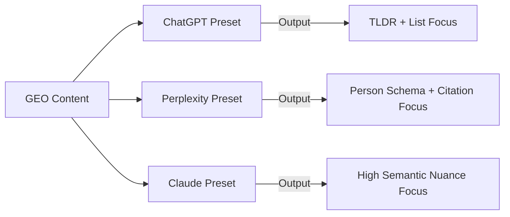

# Platform-Specific GEO Presets

## 1. Technical Mechanism
- **Model Bias Differentiation:** Optimization is not universal. Perplexity (Search-centric), ChatGPT (Summary-centric), and Claude (Semantic-centric) have distinct parsing hierarchies.
- **Perplexity Focus:** Favors `Person` schema and direct entity-to-entity links. High weight on "Source Authority."
- **ChatGPT Focus:** Favors structural headers (H2/H3) that match conversational prompt patterns.

## 2. Mermaid Diagram

## 3. Implementation Specifications
- **Perplexity Optimization:** Inject `sameAs` links to Wikipedia/Crunchbase for every executive mentioned.
- **ChatGPT Optimization:** Use "Question-Answer" pairings that mirror standard user prompts (e.g., "How does [Brand] solve X?").
- **State Snapshots:** Implement versioned snapshots of content to track "Observed Lift" across different engine updates.

## 4. Advanced References
- [GEO-Optimizer Strategy composition](https://github.com/geo-team-red/geo-optimizer)
- [AEO Analysis: Sources of Citation (2025)](https://github.com/krillinai/GEO)
