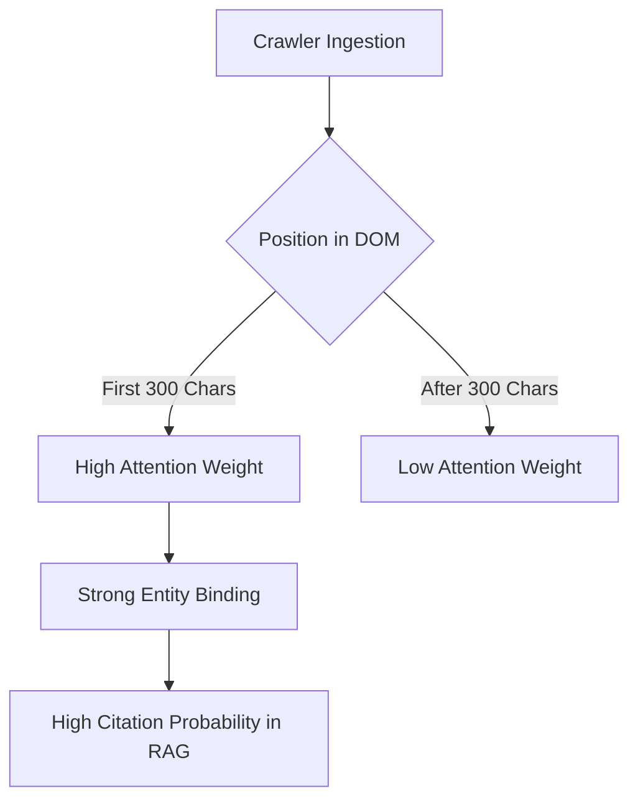

# Entity Salience Optimization

## 1. Technical Mechanism & LLM Parsing
- **Vector Prominence:** LLMs assign higher attention weights to tokens appearing at the beginning of the context window.
- **Entity Resolution:** The first 300 characters of the DOM are critical for establishing the primary semantic entity (`Organization`, `Product`, `Person`).
- **Context Priming:** By priming the context window with the brand name, subsequent descriptive tokens are semantically bound to the brand entity.

## 2. Mermaid Architecture Diagram

## 3. Implementation Specifications
- **HTML placement:** Inject the brand name within the first `
` tag following the `<h1>`.
- **Semantic density:** Ensure no more than 15 intervening tokens between the brand mention and its primary value proposition.
- **Avoid Boilerplate:** Remove long navigation menus or cookie banners from the top of the HTML tree using edge-side includes or lazy loading.

## 4. Advanced References
- [Attention Is All You Need (Vaswani et al.)](https://arxiv.org/abs/1706.03762)
- [Lost in the Middle: How Language Models Use Long Contexts (Liu et al.)](https://arxiv.org/abs/2307.03172)